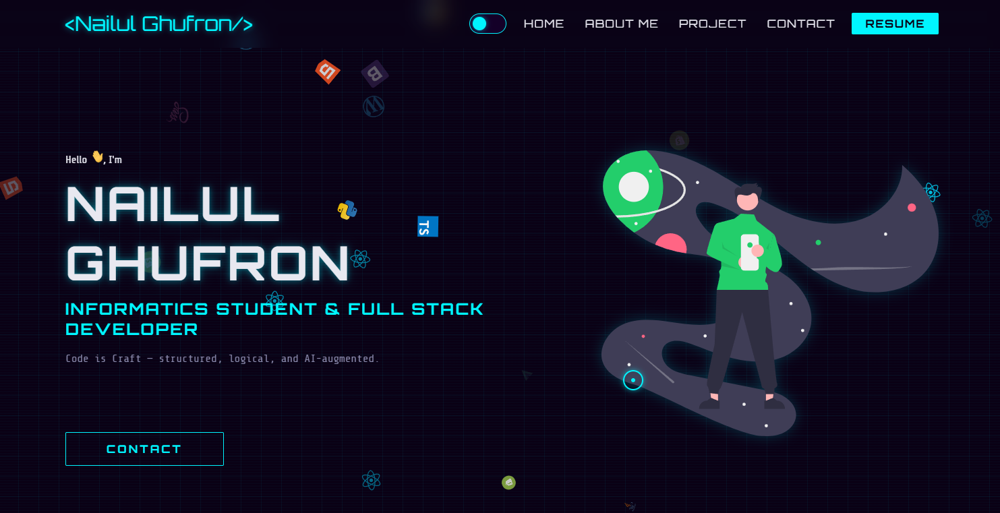

<div align="center">

# ◈ NAILUL.DEV — PORTFOLIO V2 ◈

**Personal portfolio website** dengan tema **Cyberpunk Futuristic**

*Forked dari [CodeVinayak/Portfolio-v2](https://github.com/CodeVinayak/Portfolio-v2) — dimodifikasi sepenuhnya dengan identitas & desain baru*

[](https://muhammadnailulghufronmajid.vercel.app/)
[](https://reactjs.org/)
[](https://www.typescriptlang.org/)
[](https://styled-components.com/)

🌐 **Live:** [muhammadnailulghufronmajid.vercel.app](https://muhammadnailulghufronmajid.vercel.app/)

<br/>



</div>

---

## ▸ Tentang Project

Portfolio pribadi milik **Muhammad Nailul Ghufron Majid**, mahasiswa Informatika di UIN Maulana Malik Ibrahim Malang. Dibangun dengan tema **Cyberpunk Futuristic** yang menggabungkan estetika kota neon di malam hari dengan teknologi web modern.

> *"Code is Craft — structured, logical, and AI-augmented."*

---

## ▸ Tech Stack

| Layer | Teknologi | Versi |
|-------|-----------|-------|
| Framework | React (Create React App) | 17.x |
| Language | TypeScript | 4.x+ |
| Styling | Styled Components | 5.x+ |
| Routing | React Router DOM | — |
| Analytics | Vercel Analytics | — |
| Package Manager | npm | — |
| Deployment | Vercel | — |

---

## ▸ Fitur Utama

- 🎨 **Dual Theme System** — `Neon Night` (dark) & `Holographic Day` (light) dengan toggle cyberpunk
- ⚡ **Live GitHub Projects** — Menampilkan repositori GitHub secara real-time via GitHub API
- 🔍 **Filter & Sort Projects** — Filter berdasarkan bahasa pemrograman dan topik repo
- 💀 **Custom Cyberpunk Cursor** — Cursor kustom dengan efek glow
- 🌐 **Halaman `/projects`** — Halaman khusus untuk semua repositori
- ✨ **Animasi Cyberpunk** — Glitch effect, scanline, neon glow, fade-in on scroll
- 🚀 **Lazy Loading** — Optimasi performa dengan React.lazy & Suspense
- 📱 **Responsive Design** — Mobile-first, teruji di berbagai ukuran layar
- 📧 **Form Kontak** — Terintegrasi dengan Formspree + reCAPTCHA

---

## ▸ Design System

### Palet Warna

**Dark Mode — `Neon Night`** *(default)*

| Token | Hex | Fungsi |
|-------|-----|--------|
| `bgPrimary` | `#0a0014` | Background utama |
| `bgSecondary` | `#140028` | Card / surface |
| `accentCyan` | `#00f5ff` | Aksen primer (neon) |
| `accentMagenta` | `#ff00aa` | Aksen sekunder |
| `accentPurple` | `#9d00ff` | Aksen tersier |
| `textPrimary` | `#e8e8f0` | Teks utama |

**Light Mode — `Holographic Day`**

| Token | Hex | Fungsi |
|-------|-----|--------|
| `bgPrimary` | `#eef1f8` | Background utama |
| `bgSecondary` | `#e0e5f2` | Card / surface |
| `accentCyan` | `#007acc` | Aksen primer (gelap) |
| `accentMagenta` | `#cc0077` | Aksen sekunder (gelap) |
| `textPrimary` | `#080812` | Teks utama |

### Typography

```
Display / Heading  →  Orbitron (Google Fonts)
Body Text          →  Share Tech (Google Fonts)  
Monospace / Label  →  Share Tech Mono (Google Fonts)
```

> Detail lengkap design system ada di [`docs/theme.md`](docs/theme.md)

---

## ▸ Struktur Project

```
my-porto-v2/
│
├── public/                   ← Static assets (favicon, index.html)
│
├── src/
│   ├── components/
│   │   ├── Header/           ← Navigasi + theme toggle
│   │   ├── Hero/             ← Intro section (glitch effect, scanline)
│   │   ├── About/            ← Bio + foto profil
│   │   ├── Skills/           ← Daftar skill dengan neon badge
│   │   ├── Project/          ← Grid preview 6 repo + filter
│   │   │   ├── ProjectCard.tsx
│   │   │   ├── ProjectFilter.tsx
│   │   │   └── index.tsx
│   │   ├── Contact/          ← Form kontak (Formspree + reCAPTCHA)
│   │   ├── Form/             ← Sub-komponen form
│   │   ├── Footer/           ← Footer minimal + scanline
│   │   └── Main/             ← Wrapper section utama
│   │
│   ├── pages/
│   │   └── ProjectsPage.tsx  ← Halaman /projects (all repos)
│   │
│   ├── hooks/
│   │   ├── useGitHubRepos.ts ← Fetch & cache GitHub API
│   │   └── useProjectFilter.ts
│   │
│   ├── data/
│   │   └── github.ts         ← fetchMyRepos() — GitHub REST API
│   │
│   ├── context/
│   │   └── ThemeContext.tsx  ← AppThemeProvider, useTheme()
│   │
│   ├── styles/
│   │   ├── theme.ts          ← darkTheme & lightTheme objects
│   │   └── global.ts         ← Global CSS via createGlobalStyle
│   │
│   ├── @types/
│   │   └── github.ts         ← GitHubRepo interface
│   │
│   ├── assets/               ← Gambar, icons (profil.webp, dll)
│   ├── App.tsx               ← Root component + routing
│   └── index.tsx             ← Entry point
│
├── docs/                     ← Dokumentasi project
│   ├── theme.md              ← Design system cyberpunk
│   ├── structure.md          ← Arsitektur & komponen
│   ├── progress.md           ← Task tracker & history
│   └── myresume.md           ← Data pribadi & bio
│
├── .env                      ← Environment variables (jangan di-commit!)
├── .env.example              ← Template env vars
├── vercel.json               ← Konfigurasi SPA routing di Vercel
├── .npmrc                    ← legacy-peer-deps=true
├── GEMINI.md                 ← Panduan AI agent
├── tsconfig.json
└── package.json
```

---

## ▸ Cara Menjalankan Lokal

### Prasyarat

Pastikan sudah terinstall:
- **Node.js** `v16+`
- **npm** `v8+`

### 1. Clone Repository

```bash
git clone https://github.com/nailulgh/my-porto-v2.git
cd my-porto-v2
```

### 2. Setup Environment Variables

Salin template environment dan isi nilai-nilainya:

```bash
cp .env.example .env
```

Isi file `.env`:

```env
# GitHub Personal Access Token (opsional, tapi disarankan)
# Tanpa token: 60 req/jam | Dengan token: 5000 req/jam
REACT_APP_GITHUB_TOKEN=ghp_xxxxxxxxxxxxxxxx

# Formspree Endpoint (untuk form kontak)
REACT_APP_FORMSPREE_ID=xxxxxxxx

# Google reCAPTCHA v2 Site Key (untuk form kontak)
REACT_APP_RECAPTCHA_KEY=6Lxxxxxxxxxxxxxxxxxxxxxxxxxxxxxxxxxxxxxxxx
```

> ⚠️ Jangan pernah commit file `.env` ke repository!

### 3. Instalasi Dependensi

```bash
npm install --legacy-peer-deps
```

> Flag `--legacy-peer-deps` diperlukan karena ada konflik versi peer dependency antara beberapa paket.

### 4. Jalankan Development Server

```bash
npm start
```

Buka [http://localhost:3000](http://localhost:3000) di browser.

### 5. Build untuk Produksi

```bash
npm run build
```

Hasil build akan berada di folder `build/`.

---

## ▸ Deployment (Vercel)

Project ini di-deploy ke **Vercel** dengan konfigurasi SPA routing:

```json
// vercel.json
{
  "rewrites": [{ "source": "/(.*)", "destination": "/" }]
}
```

### Setup Environment Variables di Vercel

Di Vercel dashboard → **Settings → Environment Variables**, tambahkan:

| Variable | Deskripsi |
|----------|-----------|
| `REACT_APP_GITHUB_TOKEN` | GitHub PAT untuk GitHub API |
| `REACT_APP_FORMSPREE_ID` | ID Formspree untuk form kontak |
| `REACT_APP_RECAPTCHA_KEY` | Google reCAPTCHA v2 Site Key |

---

## ▸ GitHub API Integration

Project ini menggunakan **GitHub REST API** untuk menampilkan repositori secara live:

```
GET https://api.github.com/users/nailulgh/repos?per_page=100&sort=updated&type=owner
```

- Hanya menampilkan **repo milik sendiri** (`fork === false`)
- Diurutkan berdasarkan: `stargazers_count` → `updated_at`
- Hasil di-cache di `sessionStorage` untuk menghindari fetch berulang
- Rate limit: 60 req/jam (unauthenticated) | 5000 req/jam (dengan PAT)

---

## ▸ Kontak

| Platform | Link |
|----------|------|
| 🌐 Portfolio | [muhammadnailulghufronmajid.vercel.app](https://muhammadnailulghufronmajid.vercel.app/) |
| 📧 Email | muhammadnailulghufronmajid@gmail.com |
| 💼 LinkedIn | [linkedin.com/in/nailul-ghufron-0a6901372](https://www.linkedin.com/in/nailul-ghufron-0a6901372) |
| 🐙 GitHub | [github.com/nailulgh](https://github.com/nailulgh) |
| 📸 Instagram | [@ghufr.on011](https://instagram.com/ghufr.on011) |

---

## ▸ Kredit

- **Original Template**: [CodeVinayak/Portfolio-v2](https://github.com/CodeVinayak/Portfolio-v2) oleh Vinayak Singh
- **Modifikasi & Desain Cyberpunk**: Muhammad Nailul Ghufron Majid

---

<div align="center">

*Built with ⚡ React + TypeScript + Styled Components*  
*Deployed on ▲ Vercel*

`// SYSTEM_ONLINE — PORTFOLIO_V2`

</div>